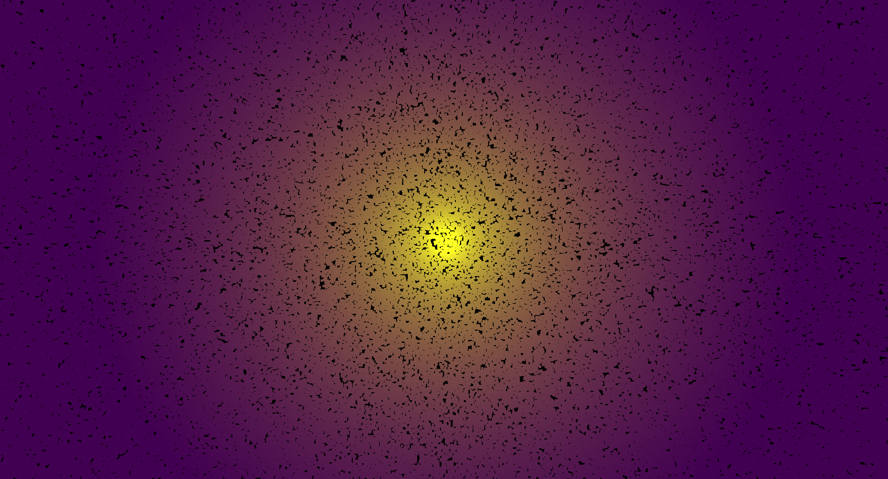

# Magneto
###  A Magnetic Field Simulator





## Overview 

Magneto is a magnetic field simulator, totally written in C++, enabling people to understand and make some experiments/ measurements with magnets.

Using parameters such as the distance between the magnet and the `Visualization Particle`, it can give an accurate estimation of the magnetic field strength

## Magnetism

Magnetism is a property of materials, giving them the ability to attract or repel other materials. In this simulator, we study the `magnetic flux density` defined by this formula: 
```math
B = (u_0 * 2*m)/(4*pi * r^3)
```

To make it easy, it is the measurement of how big is the magnetic field is.


## Roadmap

- [x] Implementing Basic view in OpenGL
- [ ] Adding User Input
- [ ] Adding Measurement Cursor

## Use

- Then you have to enter the number of points that will be plotted (ex: 500000);
- Then you have to enter the number of points that will be plotted (e.g., 500000);
- Finally, you can add the center coordinates of your magnet. Enter them without spaces, like this: (`0.0,0.0,0.0`). You can enter as many coordinates as you want. When you have finished, type `s`, and you will see your simulation.
